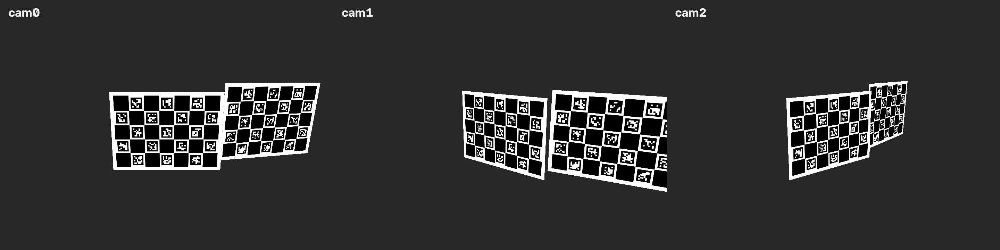
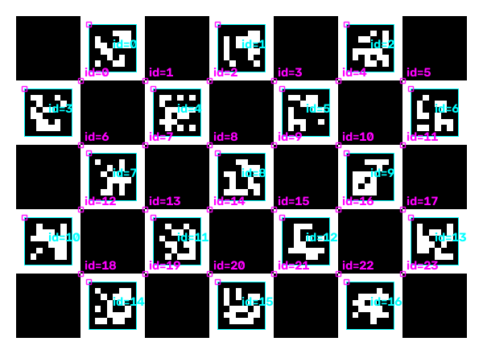
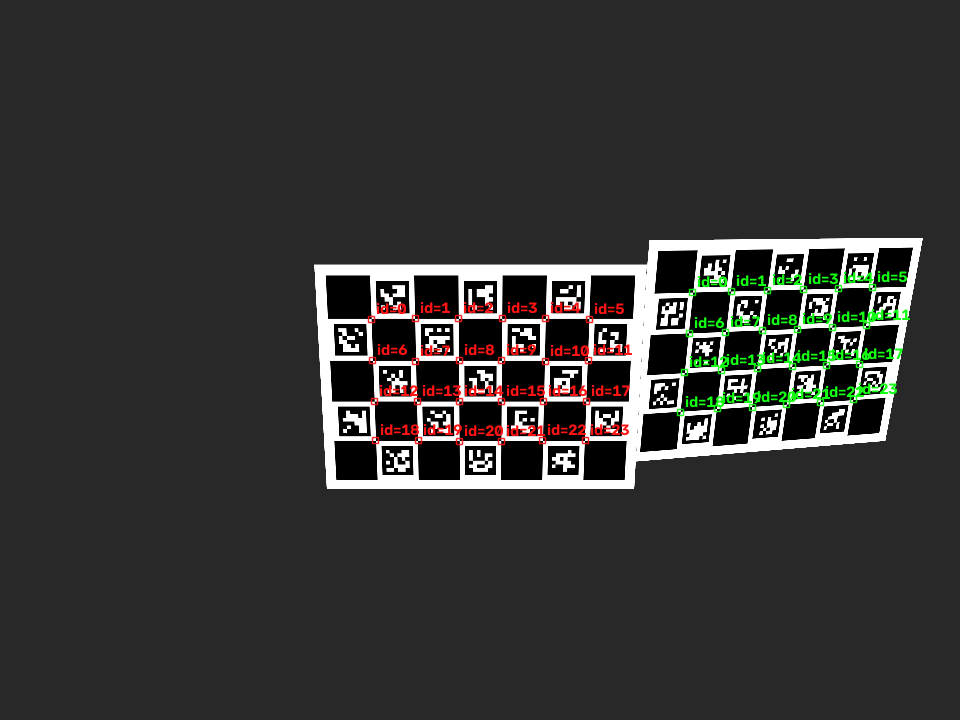
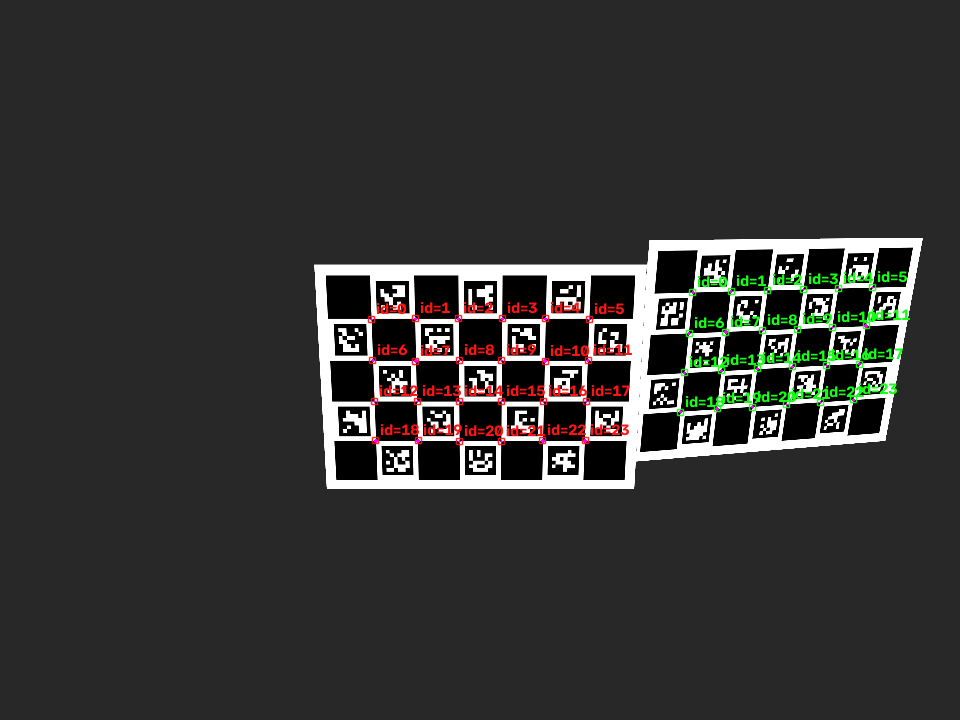
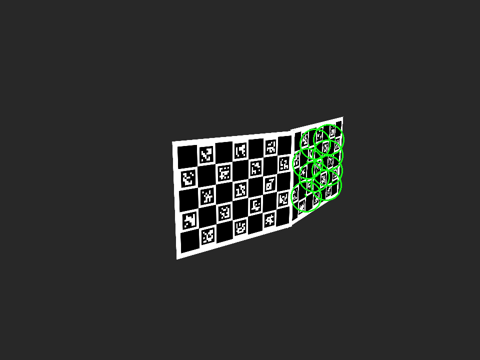

# CALICO Multi-Camera Rig Calibration & Verification Showcase

This document illustrates the end-to-end multi-camera calibration lifecycle using CALICO (Camera Calibration with Incremental Ceres Optimization) on OpenCV 5.0 with CUDA acceleration, verified against synthetic ground truth in MuJoCo.

---

## 1. Multi-Camera Rig Setup

A 3-camera system (`cam0`, `cam1`, `cam2`) is configured in a non-coplanar surround layout observing rigid ChArUco calibration boards.

*Figure 1: Multi-view perspective of the 3-camera rig observing the calibration targets simultaneously.*

- **Camera 0**: Center-left perspective observing boards 0 and 1.
- **Camera 1**: Direct center perspective observing mutual boards with wide angular coverage.
- **Camera 2**: Center-right perspective completing the multi-view baseline constraint.

---

## 2. Pattern Definition & Sub-Pixel Detection

Calibration targets utilize ChArUco patterns combining ArUco markers with chessboard saddle points, yielding robust identity tracking and sub-pixel corner refinement.

| Pattern Specification | Value |
|---|---|
| Target Type | ChArUco (`type: 0`) |
| Board Dimensions | $7 \times 5$ checker squares |
| ArUco Dictionary | `DICT_4X4_50` (`arcCode: 0`) |
| Checker Size | $80.0\text{ mm}$ |
| Marker Size | $60.0\text{ mm}$ |

| Board Definition | Detected & Refined Corners | Reprojected Fit |
| :---: | :---: | :---: |
|  |  |  |
| *Synthesized ChArUco grid with marker IDs* | *Detected markers and corner keypoints* | *Re-projected 3D points overlay* |

---

## 3. How the Optimization Works

1. **Detection & Association**:
   - Cameras detect board IDs and 2D corner locations across synchronized timesteps.
   - Initial intrinsic parameters ($K$, distortion $D$) are estimated per camera or ingested from single-camera routines.
2. **Incremental Graph Building**:
   - A graph of Foundational Relationships (FRs) between cameras and boards is established.
   - Poses are added incrementally using closed-form algebraic error estimators, avoiding local minima.
3. **Ceres Non-Linear Bundle Adjustment**:
   - A unified Ceres Solver problem minimizes the robust reprojection error:
     $$\min_{\{T_c, T_b\}} \sum_{i} \rho\left( \| \pi(T_c^{-1} T_b P_j) - p_{ij} \|^2 \right)$$
   - Robust loss functions ($\text{Huber}$, $\text{Cauchy}$) down-weight outliers from partial occlusions or reflections.
4. **Stage 5 Checkpointing**:
   - Intermediate solves are checkpointed equation-by-equation (`--checkpoint-stage5`), allowing fast recovery.

*Figure 2: 3D reconstruction of the camera network with camera optical centers, optical axes, and spatial board poses.*

---

## 4. Verification Metrics vs. Ground Truth

The calibration accuracy was verified by comparing CALICO's estimated parameters with the synthetic ground-truth poses and intrinsics.

### Intrinsics Verification

| Camera | $f_{x,\text{GT}}$ (px) | $f_{x,\text{Est}}$ (px) | $\Delta f_x$ | $f_{y,\text{GT}}$ (px) | $f_{y,\text{Est}}$ (px) | $\Delta f_y$ | $c_{x}$ error | $c_{y}$ error | Status |
| :---: | :---: | :---: | :---: | :---: | :---: | :---: | :---: | :---: | :---: |
| `cam0` | 799.92 | 799.92 | **0.00** | 799.92 | 799.92 | **0.00** | 0.00 px | 0.00 px | **PASS** |
| `cam1` | 799.92 | 799.92 | **0.00** | 799.92 | 799.92 | **0.00** | 0.00 px | 0.00 px | **PASS** |
| `cam2` | 799.92 | 799.92 | **0.00** | 799.92 | 799.92 | **0.00** | 0.00 px | 0.00 px | **PASS** |

### Relative Extrinsics (Relative Camera Poses)

| Camera Pair | Angular Rotation Error | Translation Offset Error | Tolerance Threshold | Status |
| :---: | :---: | :---: | :---: | :---: |
| `cam0` $\rightarrow$ `cam1` | **$0.518^\circ$** | **$7.53\text{ mm}$** | $\le 3.0^\circ$, $\le 25\text{ mm}$ | **PASS** |
| `cam0` $\rightarrow$ `cam2` | **$1.041^\circ$** | **$17.49\text{ mm}$** | $\le 3.0^\circ$, $\le 25\text{ mm}$ | **PASS** |
| `cam1` $\rightarrow$ `cam2` | **$1.445^\circ$** | **$20.56\text{ mm}$** | $\le 3.0^\circ$, $\le 25\text{ mm}$ | **PASS** |

### Reprojection Error (OpenCV RMS)

| Camera | Reprojection RMS Error | Requirement | Status |
| :---: | :---: | :---: | :---: |
| `cam0` | **$0.217\text{ px}$** | $\le 1.50\text{ px}$ | **PASS** |
| `cam1` | **$0.214\text{ px}$** | $\le 1.50\text{ px}$ | **PASS** |
| `cam2` | **$0.284\text{ px}$** | $\le 1.50\text{ px}$ | **PASS** |

**Final Verification Verdict**: **100% PASS across all metrics**
